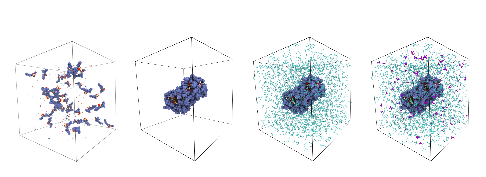

# Analysis of methanol retention in reversed micelles formed by aot/isooctane/water

<p align="center">

</p>

This repository is a technical guide to reproduce the results in
our [paper](https://localhost:8888/). 

## Requirements
- Python 3.5
- Pandas
- Numpy
- Matplotlib

## Installation
There is no formal installation since this is not a program but a guide to the article. Nonetheless, you can always download a github repository with:

```
git clone https://github.com/antadlp/rms-aot-methanol
```

## Citation
If this helps you in any way, cite this as described below.

```
@article{alvarez2022rmsMetanol,
  title={Analysis of methanol retention in reversed micelles formed by aot isooctane water},
  author={antonio, sarah and hector},
  year={2022}
}
```
------


